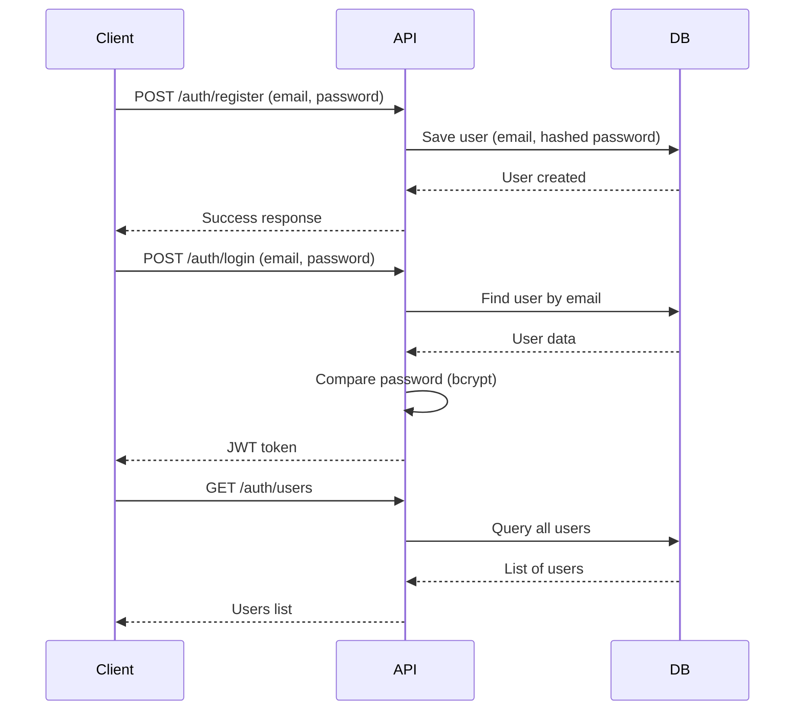
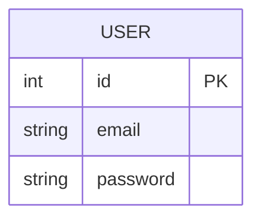

# System Details

## Sequence Diagram

```mermaid
sequenceDiagram
    participant Client
    participant API
    participant DB

    Client->>API: POST /auth/register (email, password)
    API->>DB: Save user (email, hashed password)
    DB-->>API: User created
    API-->>Client: Success response

    Client->>API: POST /auth/login (email, password)
    API->>DB: Find user by email
    DB-->>API: User data
    API->>API: Compare password (bcrypt)
    API-->>Client: JWT token

    Client->>API: GET /auth/users
    API->>DB: Query all users
    DB-->>API: List of users
    API-->>Client: Users list
```

## ER Diagram

```mermaid
erDiagram
    USER {
        int id PK
        string email
        string password
    }
```
